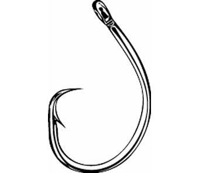
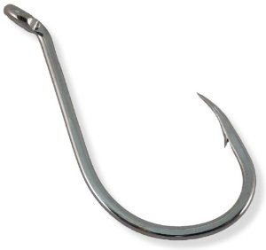
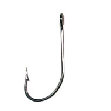
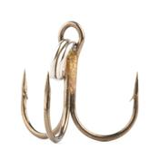
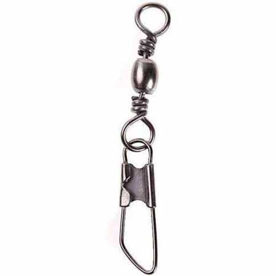
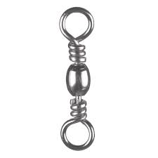
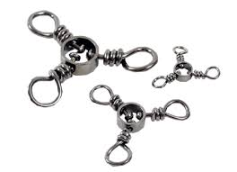

# Tackle

The goal of this article is to collect information about all the other gear
in fishing besides rods / reels / baits / lures. That is, hooks, bobbers,
sinkers, nets, fish bonkers, and swivels. Mostly this is about _terminal
tackle._

From Wikipedia: 

> Fishing tackle is the equipment used by fishermen when fishing.
> Almost any equipment or gear used for fishing can be called fishing tackle.
> Some examples are hooks, lines, sinkers, floats, rods, reels, baits, lures,
> spears, nets, gaffs, traps, waders and tackle boxes.

> Gear that is attached to the end of a fishing line is called __terminal tackle__.
> This includes hooks, leaders, swivels, sinkers, floats, split rings and wire,
> snaps, beads, spoons, blades, spinners and clevises to attach spinner blades to
> fishing lures. Sometimes the term fishing rig is used for a completed assembly
> of tackle ready for fishing.

## Hooks

### Hook Sizing

Sizes from small to large go: `7, 6, 5, 4, 3, 2, 1, 1/0, 2/0, 3/0, 4/0, 5/0, 6/0, 7/0`

So 7/0 would be a very large hook, and 7 would be a pretty tiny hook.

### Hook Types

#### Circle Hook

These hooks curve inward toward the stem and are designed to set themselves when a fish bites. You shouldn't hard set a circle hook. They work best when the fish grabs your bait / lure then turns around (which they usually do) -- and sets the hook in their cheek. Enables catch-and-release because it doesn't hook the fish's other body parts.

#### Octopus Hook

Slightly less circular than your standard Circle hook, but similar in principle. Since the bend is more slight,
it presents bait more naturally and is generally a little lighter and thinner.

#### J Hook

J Hooks are just sharp J-shaped hooks. They don't curve inward, they curve up sharply. They require you to pull in on a strike to set the hook, and are very effective for big game fishing. However they're actually illegal in some places because they often gut-hook or gill-hook fish, greviously wounding them in the process. So it makes catch and release not possible if you're using this kind of hook. Some states / parks will mandate you use circle hooks to ensure you can return fish.

#### Treble Hook

Treble hooks are three-pronged fishing hooks that are often seen on lures & artificial baits in general. They're
very effective for catching Trout and Bass in freshwater; you can put salmon eggs on each prong to imitate a cluster.

They're also used for catfish and salmon.

#### Octopus Hook

Somewhere between a J-hook and a circle hook, but more like a circle hook.

## Swivels

A swivel is a piece of tackle that lets your bait spin freely in the water without
twisting your line. That's important because it makes your bait look more alive to
watching fish!

#### Snap Swivel

The following image is called a "snap swivel" because it has a closed loop on one end and a big loop that snaps open/closed on the other.

#### Barrel Swivel

If there are two closed loops then it's a "barrel swivel."

#### Three-Way Swivel

Having three swiveling loops is most frequently used in rigs such that one loop holds a weight with a leader, and the other
loop holds a line that drifts the bait. This rig is thought to be effective because fish can't feel the
weight as well when they probe the bait.

## Bobber

A bobber is a floater (generally a 50 cent piece of plastic) that you can clip onto your
line at some point to keep your bait at a specific depth. I think for hunting smarter fish
you probably want a more expensive bobber that doesn't look so obvious.

The red and white bobber shown here is one of the most common ones and is often used to fish
for sunfish, crappies, and bluegill.

## Fish Bonker

Euphemism for a billy club or small bat. You hit the fish really hard on the head with them as a
"more humane" way to kill them so they don't suffer as much. It feels pretty brutal when you hit
them though, and reminds me that fishing is a kind of hunting.

